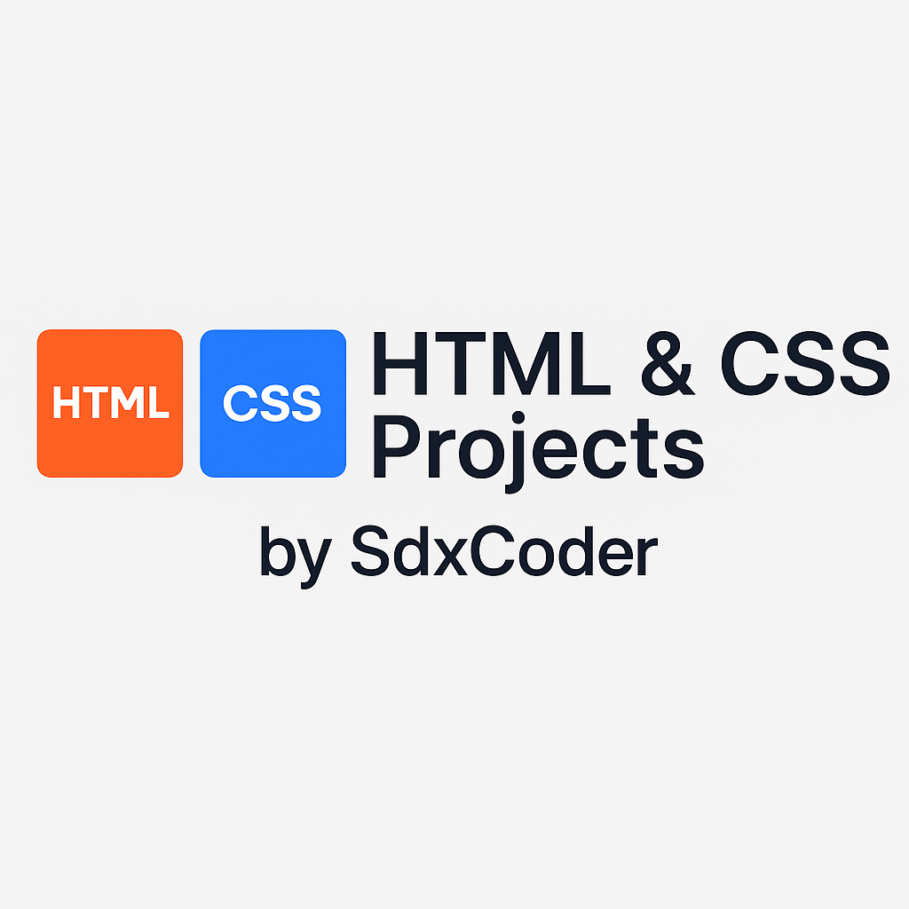

# 📄 HTML & CSS Practice Projects

A collection of simple and responsive projects built with **HTML** and **CSS**.  
Perfect for practicing frontend skills, learning web layout techniques, and building UI components from scratch.

---

## 📚 What’s Inside

- Basic web page layouts
- Responsive design examples
- UI components (cards, forms, navbars, etc.)
- Flexbox and Grid practice
- Mini-projects to sharpen HTML/CSS skills

---

## 🚀 Getting Started

You can clone this repository and open the projects locally:

```bash
git clone https://github.com/SdxCoder/html-css.git
```

Then open any folder in your browser or code editor (like VS Code) to view the project.

---

## 📸 Screenshots

> *(Optional — you can add images of a few project outputs here!)*  
> Example:
> 
> 

---

## 🛠️ Technologies Used

- **HTML5**
- **CSS3**
- **Flexbox** & **CSS Grid**
- **Responsive Design Techniques**

---

## 🎯 Goals of This Repository

- Improve frontend development skills
- Build reusable UI components
- Practice writing clean, semantic HTML and efficient CSS
- Learn by doing real mini-projects

---

## 🤝 Contributions

Feel free to fork this repo, suggest improvements, or add your own mini-projects!

---

## 📄 License

This project is licensed under the [MIT License](LICENSE).

---
